> # Pstage 1 Wrap-up Report

Covid19 has been increasingly contagious all around the globe. The most crucial thing to prevent the spread is to wear mask. However, it's hard to make sure that people are correctly wearing mask correctly. Therefore, we need a system to classify whether a person wears mask correctly, wears mask incorrectly, or not wearing.

Final LB Board Placement: `14th/48`

> ## Data

- Number of people: `4500`
- Number of images per person: `7`
  - correctly wear 5, incorrectly wear 1, not wear 1
- Image size: `384 x 512`
- `60%` of the images were provided as training set

> ## Task

There are three classes to classify: `mask`, `gender`, `age`.

- `mask`: wear correctly, wear incorrectly, not wear
- `gender`: male, female
- `age`: <30, >=30 and <60, >=60

The task is to classify all three categories at the same time, so the total of 18.

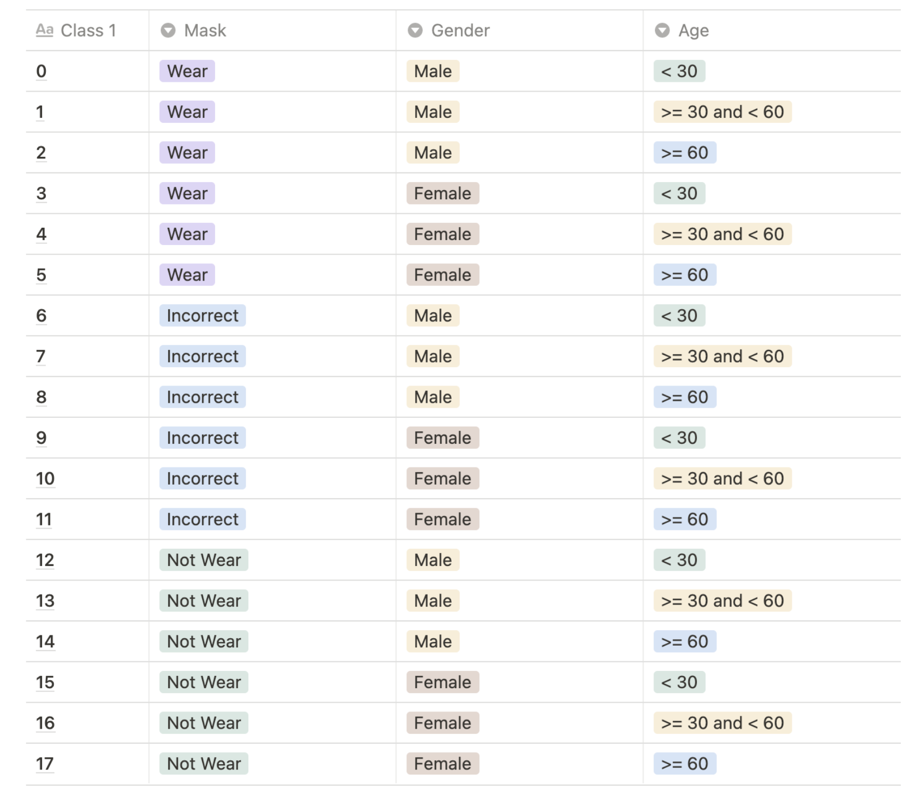

> ## Project Template

I used the pytorch project template from https://github.com/victoresque/pytorch-template.

> ## Data Processing & EDA

The hardest part of this competition was the **class imbalance**. There are much less `60>` persons than other age groups and less datasets for `not wear` and `incorrect wear`.

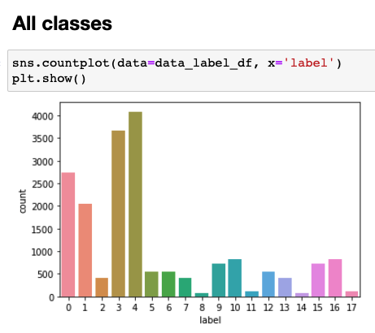
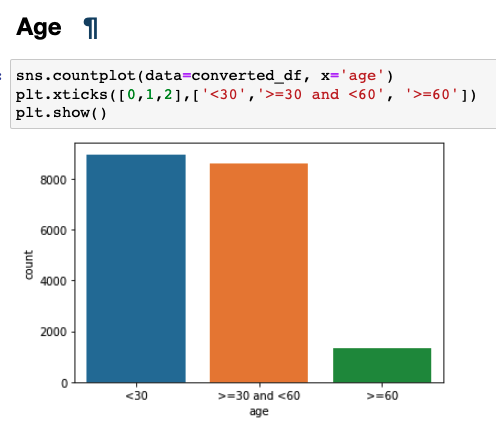
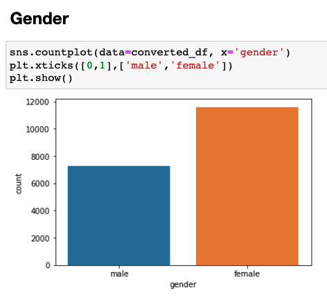
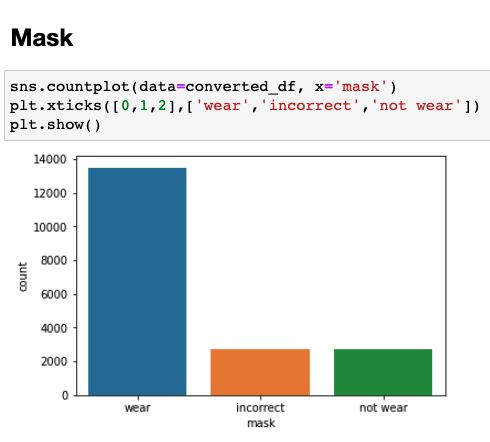

> ## Model

Pretrained CNN based models were used as backbones from `torchvision.models` with fine-tuning. The last classifier was replaced with a custom classifier with some dropouts. In order to facilitate testing, I made `PretrainedModel` class to automatically replace the last classifier with the appropriate number of output classes. Making it applicable for all pretrained model was a bit tricky but it helped a lot to quickly test different models by providing model name and number of output classes.

Many different pretrained models were used including `densenet161`, `resnet18`, `resnet50`, `resnet101`, `efficientnet_b0,1,2,3`, `wide resnet`, `resnext`, `regnet`. For mask and gender classifications, most models worked pretty fine but for the age classification, `densenet161` seemed to have the best performance.

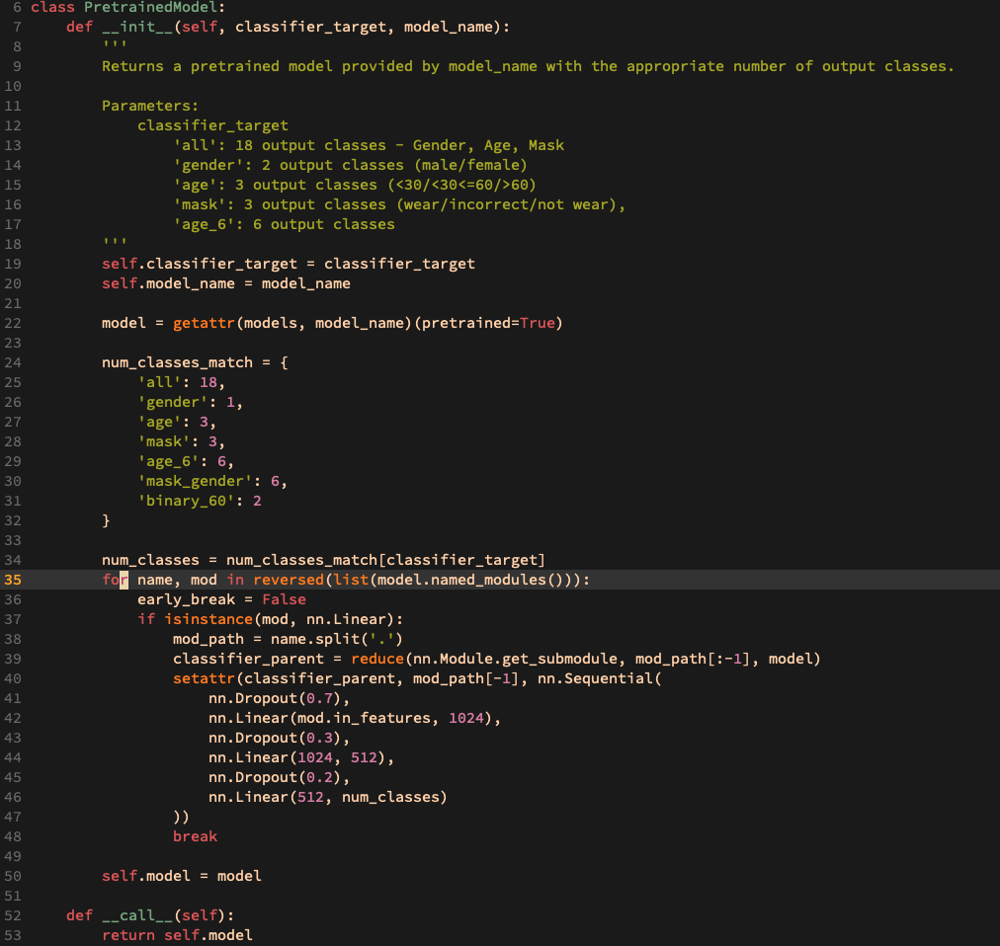

> ## Loss Function

### Weighted Cross Entropy Loss

Instead of plain cross-entropy loss, I put more weights to **harder classes** such as `>60 age` and `class with much less data`.

### Focal Loss

Good for imbalanced dataset. The point of focal loss is to amplify losses for harder classes. The focal loss brought the best performance increase as the competition dataset is highly imbalanced.

### F1 Loss

Revised F1 loss. For all tasks, this brought worse performances.

### Combined Loss (Focal Loss + F1 Loss) with weights

I thought F1 loss dominating the whole loss resulted in bad performances so I gave `0.2` weight to F1 loss and `0.8` weight to focal loss but the performance was bad.

> ## Optimizer

### Adam

Adam optimizer is the industry standard for many tasks but Adam showed poor generalization performances.

### SGD + momentum

SGD + momentum showed the best performances. Although it took quite long to converge, the validation set performance for the **same loss** was better than Adam.

- lr=0.01,
- momentum=0.9

> ## Learning Rate Scheduler

Different learning rate schedulers such as `StepLR`, `CosineAnnealingLR`, `ReduceLROnPlateau`, but learning rate schedulers did not have much impact since overfitting inevitably happened for all trials within `10 epochs`. Among them, I used `StepLR` with `step_size=4`, `gamma=0.15`.

> ## Approaches

## 1) Separate models for each class

I thought it'd be easier for a network to learn to classify age, gender, mask separately instead of classifying all at one shot. Also, I determined that mask, gender, age have no notable correlation with each other. For each task, three models are ensembled with soft voting, resulting in 9 backbone models in total. However, the ensemble performance for public leader board was way worse than the validation set performance (almost 98%). I didn't understand why but I later realized this was due to the **bad train/validation set**. I randomly split the dataset into train/val set. However, **one person** has **7 images** so if those 7 images are randomly distributed into both train and validation set, then the classifier will learn for a person and test for the validation set where the **same person** is included. Therefore, I suspect that there was a huge bias in the validation set, especially for age.

## Dataset Preprocessing for proper train/val set

After realizing the bias from 1), I tried **K-fold cross validation** to objectively measure the validation set performance. The important thing is to divide train/val sets is according to **age**. The reason is that the gender is somewhat equally balanced and mask is less relevant to the person. Therefore, if we divide the datasets according to age, both train/val sets have equal proportion of all **mask**, **gender**, and **age**. Each age group is divided into 5 folds and each fold from three groups is consecutively used as validation set.

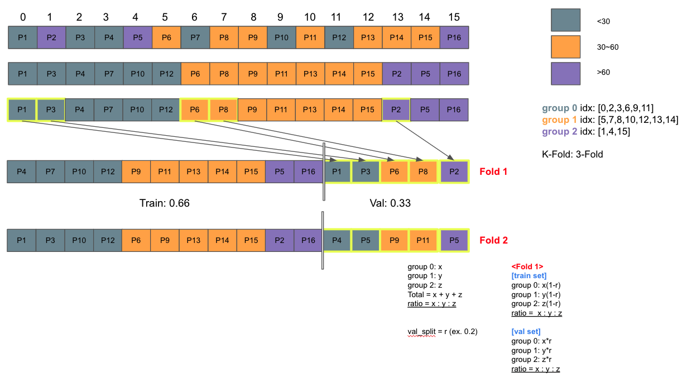

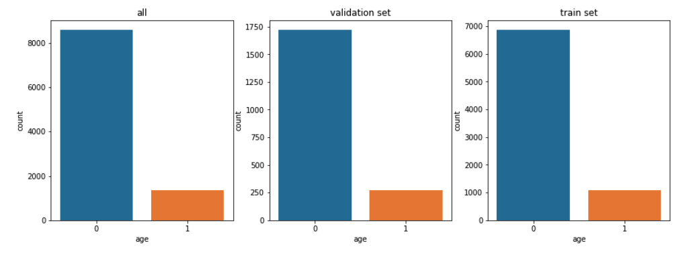
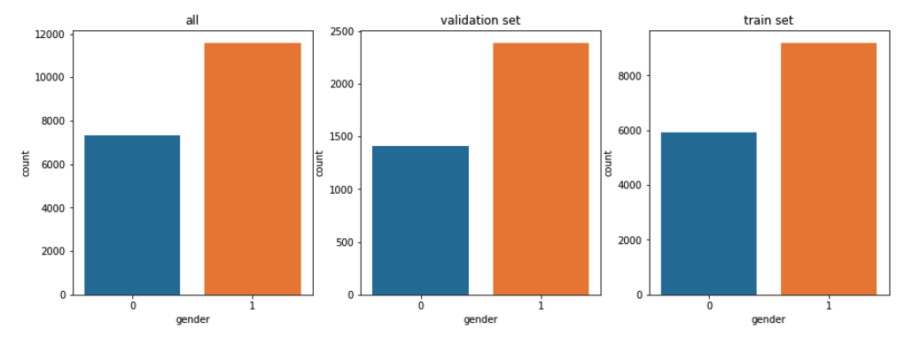
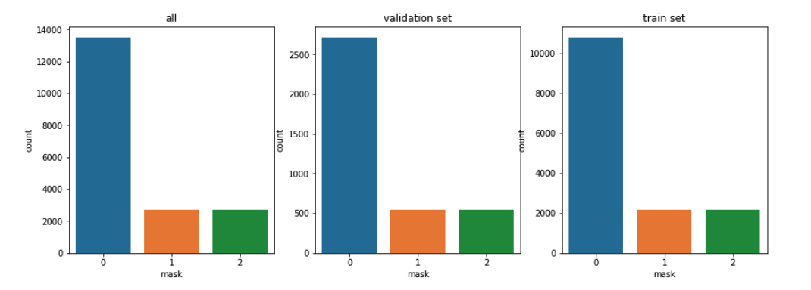

## 2) Models for all 18 classes

Some of the teammates told me that building a classifier for all classes works better which I find it quite counter-intuitive. After the train/val set preprocessing, I tried building models to classify all **18 classes** at once.I mainly used `densenet161` as backbone model. The model is trained for all **5 folds**, resulting in 5 different densenet models which are later ensembled with **hard voting**. This was a simple approach but it scored `74.3175%` accuracy and `0.6858` f1-score on the leader board.

## 2) Ensemble of 18 class models + gender/mask models + age models

After visualizing predictions from 1) and 2), I realized that correctly predicting age is the hardest. Especially, classifying `30~60` and `60>` was **extremely difficult**. In fact, it's often impossible even for humans to correctly classify 59 years and 60 years old person. Moreover, the `>60` age group dataset was highly imbalanced.

Meanwhie, gender and mask were relatively easy. Therefore, I decided it'd lead to better performance if we models for `mask/gender` and `age`. For age, I further divided age groups into `~20, 30~30, 30~47, 47~55, 55~60, 60~`, total of 6 classes. My hypothesis was that if a model learns **more difficult age classifications**, then it would be easier to classify original three categories. In fact, this hypothesis worked and led to much better performance (+3% accuracy).

1. Models for `mask/gender` - total 6 classes
2. Models for `age` - total 6 classes.

For each task(mask/gender, age), `densenet161` was trained for each **5 folds** and ensembled with hard voting. Then, the results were combined with 7 other models built by teammates that classify 18 classes with hardvoting.

Gender/mask models achieved nearly **98~99%** accuracy in the validation sets and seemed to work very well for test set. However, age classifier was still extremely difficult to train.

Still, this method achieved the best team performance so far with `79.0952% accuracy` and `0.7410 f1-score` in the test set. I felt really good!

## 3) Age Model - Probabilistic Binary Classification for 60~ years old

From the previous experiments, our team found out that it's relatively easy to classify for `mask`, `gender`, and `<30 age`. Now, it's important to correctly classify `30~60` and `60~` age groups.

Instead of predicting 6 classes for age, I thought binary classification for `~60` and `30~60` age groups would be easier for the model. First, all the images whose age is below 30 is removed from the csv and the remaining `9933` images were trained.

Also, one idea came up to my mind that we usually take `argmax` to determine the predicted class. However, we're missing one important information: `predicted probability`. Wouldn't it tell us much more information if we access the probability? For example, if the model predicts that the image is `60~` years old with probability of `50.0001%` is very different from `99.999999%`. Therefore, I set the `threshold` that if the predicted class probability is greater than this threshold, then the predicted class is always `1` or `60~`.

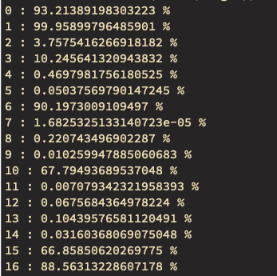

The above picture shows prediction probabilities for `class 1` or `60~ age`. Although predicted as class 1, the assigned probabilities must give some useful information since it tells us how **confident** the model predicts a certain class. I tried with different thresholds and `0.08` or `8%` seemed to work the best. In other words, if the predicted probability for class 1 is greater than 0.08, then it's always predicted as class 1.

This method achieved the highest performance among our team.

> ## Things to Try

- SWA (Stochastic Weight Averaging)
- Gradient Cam
- Wandb, Tensorboard
- Better cooperation
- How to better deal with class imbalance?
- How to better deal with overfitting?
- Pytorch Lightning
