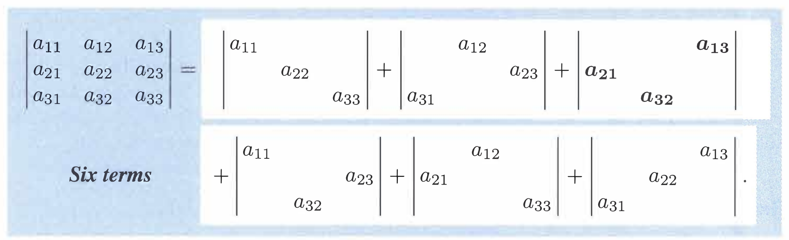

> # Keywords

**[1]** **2 by 2**: $ad-bc$ has $2!$ terms with $\pm$ signs. **n by n**: $det(A)$ **adds n! terms with** $\pm$ **signs**.

**[2]** For $n=3$, $det(A)$ adds $3!=6$ terms. Two terms are $+a_{12}a_{23}a_{31}$ and $-a_{13}a_{22}a_{31}$. **Rows 1, 2, 3, and columns 1, 2, 3 appear once in each term**.

**[3]** That minus sign came because the column order $3, 2, 1$ needs one exchange to recover $1, 2, 3$.

**[4]** The six terms include $+a_{11}a_{22}a_{33}-a_{11}a_{23}a_{32}=a_{11}(a_{22}a_{33}-a_{23}a_{32}) = a_{11}$(**cofactor** $C_{11}$)

**[5]** Always $det(A) = a_{11}C_{11}+a_{12}C_{12d+ \cdots + a_{1n}C_{1n}}$. Cofactors are determinants of size $n-1$.

> # Three ways to find determinant

We can find the determinent in three ways

1. **Pivot formula**
2. **Big formula**
3. **Cofactors**

> # Pivot Formula

Elimination leads $A$ to $PA=LU$, then the **pivots** $d_1,...,d_n$ are on the **diagonal** of the upper triangular $U$. Then, the **product of the pivots (with sign) is the determinant**.

We can show that it's true very simply.

\[[ det(P)det(A) = det(L) det(U) = (1)(d_1d_2\cdots d_n) \]]

Since $det(P)=\pm 1$,

\[[ det(A) = \pm d_1d_2 \cdots d_n \]]

Now, consider the **corner** submatrix $A_k$ (first $k$ pivots). We can find the $k^{th}$ pivot using the determinant

\[[ k^{th}\ \text{pivot} = d_k = \frac{det(A_k)}{det(A_{k-1})} \]]

> # The Big Formula

|                  |
| :-------------------------------------------: |
| _Introduction to Linear Algebra, 5th edition_ |

The big formula has **n! terms**. Each product has **one entry** from **each row and each column** which is why there're $n!$ cases (permutations).

Notice that the **sign** of the product is determined by the **permutation matrix** for each product.

For example,

\[[ \begin{vmatrix} a_{11} & & \\\ & a_{22} & \\\ & & a_{33} \end{vmatrix} = a_{11}a_{22}a_{33}\begin{vmatrix} 1 & & \\\ & 1 & \\\ & & 1 \end{vmatrix} \]]

## Summary

$det(A)$ = sum over all $n!$ column permutations $P=(\alpha, \beta,...,w)$

\[[ det(A) = \sum det(P) a_{1\alpha}a_{2\beta}\cdots a_{nw} \]]

> # Cofactor

The determinant can also be found using **cofactor**. From the big formula above, 3 by 3 matrix has a determinant which is a sum of $3!$ products. Notice that you can convert the 6 products into **3 pairs**.

\[[ det(A) = a_{11}(a_{22}a_{33}) + a_{12}(a_{23}a_{31}-a_{21}a_{33})+a_{13}(a_{21}a_{32}-a_{22}a_{31}) \]]

The quantities in **parentheses** are called **cofactors** which are 2 by 2 determinants from rows 2 and 3. The first row contributes the factors $a_{11}, a_{12}, a_{13}$ and the lower rows form the cofactors $C_{11}, C_{12}, C_{13}$

Define $M_{1j}$ is a submatrix with row 1 and column $j$ **removed**. Then, the cofactors along row $1$ are defined,

\[[ C_{1j} = (-1)^{1+j} det(M_{1j}) \]]

Then, the determinant can be expressed as

\[[ det(A) = a_{11}C_{11} + a_{12}C_{12} + \cdots + a_{1n}C_{1n} \]]

## General form

The determinant is the dot product of any row $i$ of $A$ with its cofactors using other rows:

\[[ det(A) = a_{i1}C_{i1} + a_{i2}C_{i2} + \cdots + a_{in}C_{in} \]]

Each cofactor $C_{ij}$ (order $n-1$ without row $i$ and column $j$) includes its correct sign:

\[[ C_{ij} = (-1)^{i+j}det(M_{ij}) \]]

> # References

[1] Introduction to Linear Algebra, 5th edition
