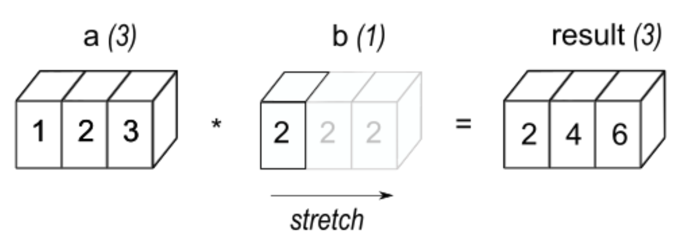
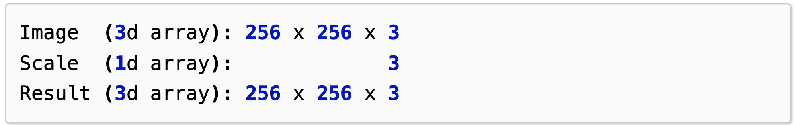
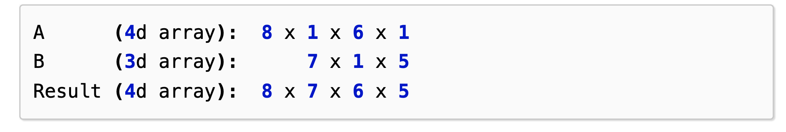
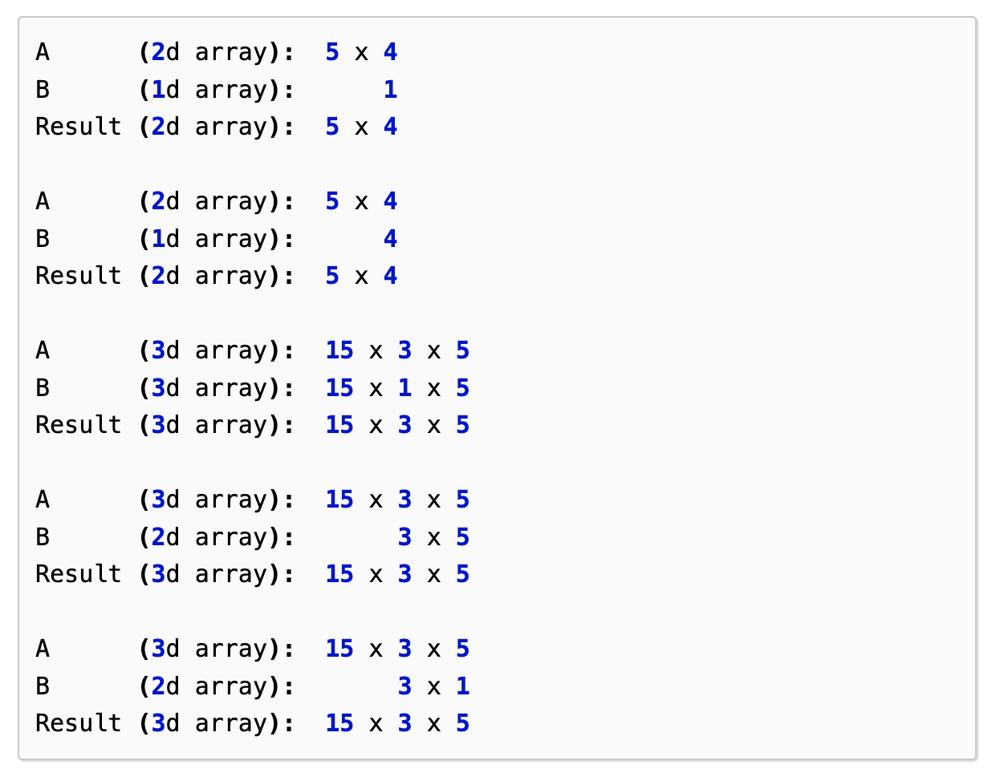
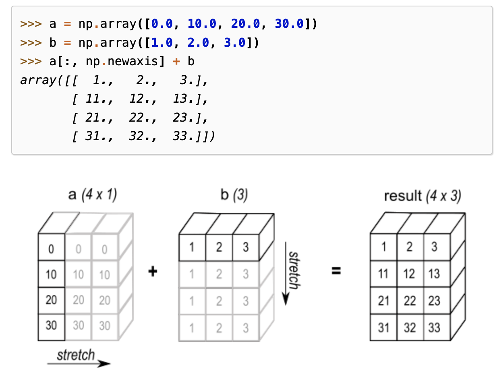

```python
import numpy as np
```

> # Broadcasting

Broadcasting occurs when we perform arithmetic operations on arrays with **different shapes**. The **smaller array** is broadcasted across the larger array so that they have compatible shapes.

> # Exact same shape

NumPy operations are done **element-wise** when two arrays have **exactly same shape**.

```python
a = np.array([1, 2, 3])
b = np.array([2, 2, 2])
a * b
```

    array([2, 4, 6])

However, what if the arrays have different shapes? This is where broadcasting kicks in.

> # 1D & Scalar

The simplest broadcasting is between an **array** and a **scalar**. The scalar value `b` is "stretched" into an array with the same shape as `a`.

|                      |
| :-------------------------------------------------------------------: |
| _[NumPy](https://numpy.org/doc/stable/user/basics.broadcasting.html)_ |

```python
a = np.array([1, 2, 3])
b = 2
a * b
```

    array([2, 4, 6])

> # General Broadcasting Rules

When we operate on two arrays, NumPy **compares their shapes element-wise**.

It starts from **rightmost dimensions** to **leftmost dimensions**.

Now, these two dimensions are compatible when

> (1) they're **equal** or

> (2) one of them is **1**

If the conditions are not met, `ValueError: operands could not be broadcast together` exception is thrown.

Note that arrays **do not need to have the same number of dimensions**. Let's take an example.

|                      |
| :-------------------------------------------------------------------: |
| _[NumPy](https://numpy.org/doc/stable/user/basics.broadcasting.html)_ |

Here is what's happening above:

**[1]** Align the two shapes **to the right**

**[2]** Starting from the rightmost, compare the two dimensions (`3` and `3`) in this case.

**[3]** **If they're equal** OR **one of them is 1**, the smaller dimension is broadcasted by simplying copying or stretching.

```python
a = np.random.randn(16, 4, 64, 64)
b = np.random.randn(4, 1, 64)

c = a * b

'''
(16, 4, 64, 64)
(    4,  1, 64)
---------------
(16, 4, 64, 64)
'''
print("a shape: {:>15}".format(str(a.shape)))
print("b shape: {:>15}".format(str(b.shape)))
print("c shape: {:>15}".format(str(c.shape)))
```

    a shape: (16, 4, 64, 64)
    b shape:      (4, 1, 64)
    c shape: (16, 4, 64, 64)

## Example 1

|                      |
| :-------------------------------------------------------------------: |
| _[NumPy](https://numpy.org/doc/stable/user/basics.broadcasting.html)_ |

In the above example, broadcasting starts from the **right-most** dimension.

## Example 2

|                      |
| :-------------------------------------------------------------------: |
| _[NumPy](https://numpy.org/doc/stable/user/basics.broadcasting.html)_ |

## Example 3 - `np.newaxis`

|                      |
| :-------------------------------------------------------------------: |
| _[NumPy](https://numpy.org/doc/stable/user/basics.broadcasting.html)_ |

> # References

[1] https://numpy.org/doc/stable/user/basics.broadcasting.html
